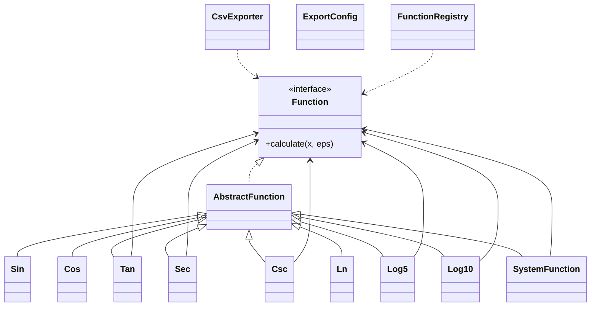

# Лабораторная работа №2

## Текст задания

Провести интеграционное тестирование программы, вычисляющей систему функций:

- при `x <= 0`: `(((((sin(x) / csc(x)) - sec(x)) * tan(x)) / (tan(x) - cos(x)^3)) / tan(x))`
- при `x > 0`: `(((((log_5(x)^2) + log_10(x))^2) / (log_5(x) / ln(x)))^3)`

## Структура приложения

- базовые функции: `sin(x)` и `ln(x)`
- производные тригонометрические функции: `cos(x)`, `tan(x)`, `sec(x)`, `csc(x)`
- производные логарифмические функции: `log5(x)`, `log10(x)`
- система функций: `SystemFunction`
- экспорт значений любого модуля в CSV: `CsvExporter`

UML-диаграмма также сохранена в [uml.puml](./uml.puml).



## Область допустимых значений

### Ветка `x <= 0`

Для выражения
`(((((sin(x) / csc(x)) - sec(x)) * tan(x)) / (tan(x) - cos(x)^3)) / tan(x))`
необходимы условия:

- `sin(x) != 0`, то есть `x != k*pi`
- `cos(x) != 0`, то есть `x != pi/2 + k*pi`
- `tan(x) != 0`
- `tan(x) - cos(x)^3 != 0`

Итого:

- `x <= 0`
- `x != k*pi`
- `x != pi/2 + k*pi`
- `x` не является решением уравнения `tan(x) = cos(x)^3`

### Ветка `x > 0`

Для выражения
`(((((log_5(x)^2) + log_10(x))^2) / (log_5(x) / ln(x)))^3)`
необходимы условия:

- `x > 0`
- `ln(x) != 0`
- `log_5(x) != 0`

Так как `ln(1) = 0` и `log_5(1) = 0`, получаем:

- `x > 0`
- `x != 1`

## Реализация требований

- `sin(x)` реализована через ряд Тейлора в [Sin.java](../src/main/java/functions/trig/Sin.java)
- `ln(x)` реализована через степенной ряд в [Ln.java](../src/main/java/functions/log/Ln.java)
- все остальные функции выражены через базовые модули
- для каждого модуля реализована собственная табличная заглушка в `src/test/java/support/stubs`
- приложение поддерживает экспорт значений любого модуля через CLI:

```bash
java -cp target/classes Main --function system --start -5 --end 5 --step 0.1 --eps 1e-6 --out result.csv --delimiter ,
java -cp target/classes Main --function sin --start -3.14 --end 3.14 --step 0.1 --out sin.csv
java -cp target/classes Main --function ln --start 0.2 --end 5 --step 0.1 --out ln.csv
```

## Стратегия интеграции

Выбрана поэтапная восходящая стратегия:

1. Собирается система целиком на табличных заглушках.
2. В систему по одному подключаются реальные модули `sin`, `cos`, `tan`, `sec`, `csc`.
3. Затем по одному подключаются реальные модули `ln`, `log5`, `log10`.
4. На каждом шаге проверяются корректные значения и точки разрыва.

Такая стратегия позволяет локализовать ошибку в конкретном подключаемом модуле и сохранить стабильный эталон за счёт остальных заглушек.

## Тестовое покрытие

Используются JUnit 5 и JaCoCo.

Классы эквивалентности:

- `x <= 0`, корректные точки тригонометрической ветки
- `x > 0`, корректные точки логарифмической ветки
- точки вне ОДЗ: `x = 0`, `x = -pi/2`, `x = 1`
- некорректный шаг CSV-экспорта
- пользовательский выбор модуля и параметров экспорта

Контрольные точки:

- `x = -pi/4` для тригонометрической ветки
- `x = 2` для логарифмической ветки
- `x = 0`, `x = -pi/2`, `x = 1` как особые точки

Интеграционные тесты расположены в [SystemFunctionIntegrationTest.java](../src/test/java/functions/system/SystemFunctionIntegrationTest.java).

## CSV-выгрузки и графики

В репозитории приложены CSV-файлы:

- [csv/system.csv](./csv/system.csv)
- [csv/sin.csv](./csv/sin.csv)
- [csv/ln.csv](./csv/ln.csv)

### График `sin(x)`

```mermaid
xychart-beta
    title "sin(x)"
    x-axis [-3.0, -2.0, -1.0, 0.0, 1.0, 2.0, 3.0]
    y-axis "y" -1.0 --> 1.0
    line [-0.1411, -0.9093, -0.8415, 0.0, 0.8415, 0.9093, 0.1411]
```

### График `ln(x)`

```mermaid
xychart-beta
    title "ln(x)"
    x-axis [0.5, 1.0, 1.5, 2.0, 3.0, 4.0, 5.0]
    y-axis "y" -1.0 --> 2.0
    line [-0.6931, 0.0, 0.4055, 0.6931, 1.0986, 1.3863, 1.6094]
```

### График системы функций

```mermaid
xychart-beta
    title "system(x)"
    x-axis [-2.0, -1.5, -1.0, -0.5, 0.5, 2.0, 3.0]
    y-axis "y" -10.0 --> 10.0
    line [1.4310, 0.9319, 0.6663, 0.7443, 0.0000, 0.0553, 2.9329]
```

## Выводы

В ходе работы реализована система функций на базе рядов для `sin(x)` и `ln(x)`, выполнено интеграционное тестирование поэтапной заменой заглушек на реальные модули, добавлен экспорт значений любого модуля в CSV и подготовлены материалы для отчёта. Полученное решение покрывает вычислительную часть, интеграционные тесты и артефакты, необходимые для защиты лабораторной работы.
